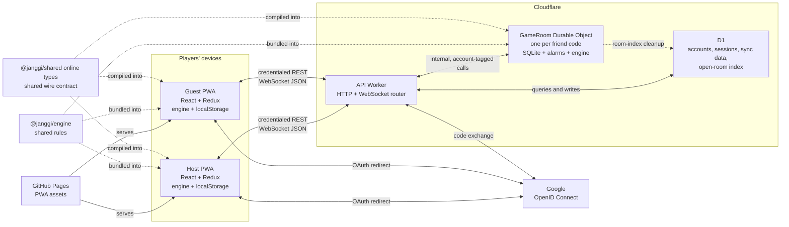

# Playing a friend online

The implemented architecture of a friend-code game, from the first Google
sign-in to the room being deleted. This also records why its boundaries were
chosen. The Cloudflare free-plan figures below were re-checked 2026-10-02.

## System view

There is no peer-to-peer connection. Both browsers speak to the same
code-named Durable Object through the API Worker. The rules engine and wire
types are compiled into both sides; they are shared code, not services.



Alchemy provisions the Worker, D1 database, three rate limiters, and the
SQLite-backed `GAME_ROOMS` namespace. The custom Worker domain and Google
OAuth client are manual setup because they belong to their owners, not to an
Alchemy application.

| Component          | Responsibility                                                                               |
| ------------------ | -------------------------------------------------------------------------------------------- |
| React page         | Offers opt-in sign-in, room creation or entry, and renders room state.                       |
| Redux online state | Holds the current connection, seat, opponent, and reconstructed friend game.                 |
| `FriendConnection` | Owns one WebSocket, introduces on every connection, and retries drops.                       |
| API Worker         | Routes HTTP or upgrades, enforces origins, authenticates sessions, and reaches D1 or a room. |
| D1                 | Holds accounts, hashed sessions, the sync document, and one open-room index row per host.    |
| `GameRoom`         | Serialises a room, validates messages and play, delivers events, and schedules deletion.     |
| Engine             | Offers moves in each PWA and authoritatively applies them inside the room.                   |

## End-to-end flow

The sign-up and sign-in path is the same: the callback finds an account for
Google's subject or creates one. Each player completes it independently.

```mermaid
sequenceDiagram
  autonumber
  participant H as Host PWA
  participant G as Guest PWA
  participant O as Google
  participant W as API Worker
  participant D as D1
  participant R as GameRoom
  participant E as Server engine

  Note over H,W: Sign-up or sign-in; repeat independently for the guest
  H->>H: Keep signing-in state and return address
  H->>W: GET /api/auth/google?return=...
  W-->>H: 302 to Google; OAuth-attempt cookie
  H->>O: Authorize with openid scope and PKCE
  O-->>H: Redirect with code and state
  H->>W: GET callback with code, state, and attempt cookie
  W->>O: Exchange code and verifier
  O-->>W: Validated ID-token claims (sub)
  W->>D: Find or create account; store session-token hash
  W-->>H: Session cookie; redirect to original app address
  H->>W: GET /api/me, then best-effort data sync

  Note over H,R: Create the room and seat the host
  H->>W: POST /api/rooms {side, awayDays}
  W->>D: Conditionally insert open-room index
  W->>R: Internal POST /open for code-named object
  R->>R: Store initial RoomState and set one-day alarm
  W-->>H: 201 {code}, or 409 with existing code
  H->>W: WebSocket upgrade with session and Origin
  W->>D: Validate session
  W->>R: Internal upgrade with trusted account ID
  R-->>H: Accepted WebSocket
  H->>R: introduce {displayName, optional look keys}
  R-->>H: waiting

  Note over G,R: A join link preserves ?join= through sign-in
  G->>W: WebSocket upgrade for the code
  W->>D: Validate session
  W->>R: Internal upgrade with trusted account ID
  R-->>G: Accepted WebSocket
  G->>R: introduce {displayName, optional look keys}
  R->>R: Seat guest on the other side
  R-->>H: matched {side, guest introduction}
  R-->>G: matched {side, host introduction}

  H->>R: choose-setup
  Note right of R: First setup is stored but not revealed
  G->>R: choose-setup
  R->>E: Deal Casual game from both setups
  R->>R: Store engine GameState
  R-->>H: started {hanSetup, choSetup}
  R-->>G: started {hanSetup, choSetup}

  loop Every move, pass, call, draw action, or resignation
    Note over H,G: Either player may be the sender
    H->>R: act {action}
    R->>E: Validate turn and transition
    alt Accepted
      E-->>R: Next GameState and outcome
      R->>R: Store state and append seated action
      R-->>H: acted {by, action}
      R-->>G: acted {by, action}
      H->>H: Apply echoed action through local engine
      G->>G: Apply echoed action through local engine
    else Rejected
      E-->>R: Illegal or out of turn
      R-->>H: rejected {reason}; state unchanged
    end
  end

  opt A player changes the look they share
    G->>R: update-look {boardKey?, piecesKey?}
    R->>R: Replace look kept on guest's seat
    R-->>H: opponent-look {boardKey?, piecesKey?}
  end

  Note over G,R: A non-4404 close is treated as a connection drop
  G-xR: Socket closes
  R->>R: Record goneSince
  R-->>H: opponent-left
  G->>W: Retry upgrade with exponential backoff
  W->>D: Revalidate session
  W->>R: Replace old socket and tag the new one
  G->>R: introduce with current look
  R-->>G: snapshot {side, opponent, setups, history}
  R-->>H: opponent-back
  G->>G: Deal and replay history through local engine

  alt Game finishes
    R->>D: Release host's open-room index immediately
    Note right of R: Alarm at finishedAt + 2 minutes
  else A guest never joins
    Note right of R: Alarm at createdAt + 1 day
  else Both players are away
    Note right of R: Alarm at later goneSince + awayDays
  end
  R->>R: Alarm closes sockets with 4404
  R->>D: Delete open-room index, idempotently
  R->>R: Delete alarm and all room storage
```

The sequence shows the successful path and the three deletion deadlines.
Failure and reconnection behaviour is detailed below.

## Sign-up, session, and adjacent sync

Sign-in is opt-in. A device recorded as signed out makes no API request. The
only general entry is Settings; a signed-out player who opens `?join=CODE` is
offered sign-in, and still makes no request until they accept it.

Before redirecting, the PWA keeps `signing-in` locally and puts the full
current address in `return`, including a join query. The API accepts that
return address only when its origin is allowed. It puts the random state,
PKCE verifier, and checked return address in a ten-minute, callback-scoped,
`HttpOnly; Secure; SameSite=Lax` cookie.

Google is asked for `openid` only. The callback validates state, exchanges the
code with PKCE through `oauth4webapi`, and reads Google's stable `sub`. D1
stores that subject, an application display name, and only the hash of a
random session token. The browser gets the token in a 30-day
`HttpOnly; Secure; SameSite=Lax` cookie. No Google email or name is requested
or stored.

On return, the PWA asks `/api/me` who the session belongs to, then runs the
existing best-effort sync. Its opaque D1 blob carries progress, custom styles
and deletion stamps, ratings history, and selected preferences. It never
carries the game on the board or a friend room. `localStorage` remains the
source of truth; an unavailable API pauses sync without interrupting local
play.

## Opening and joining a room

The authenticated host sends `POST /api/rooms` with `{side, awayDays}`. Room
creation is limited to ten attempts per account per minute. The D1 `rooms`
table conditionally claims a cryptographically random eight-character code,
enforces one open room per **host**, and caps the deployment at 200 indexed
rooms. A guest may still host another room of their own.

The index is deliberately small: code, host account ID, and creation time. It
enforces capacity, gives a host their existing code in a `409`, and releases
the host to make another room. The live game never goes there.

Other room-opening failures are `400` for an invalid choice, `401` without a
session, `403` for an untrusted origin, `429` at the rate limit, `502` when
the Durable Object cannot be opened, and `503` at capacity or after repeated
code collisions.

After claiming the index row, the Worker addresses `GAME_ROOMS.idFromName`
with the code and internally opens the object. If that fails, it removes the
index row. The room stores the code and an empty `RoomState`, then sets its
unjoined alarm. The host opens the WebSocket and sends `introduce` as the
first frame.

There is no separate join request. A guest locally parses a typed code or a
`?join=` link, then opens `/api/rooms/<CODE>/socket`. For every upgrade the
Worker:

1. Parses the path and code.
2. Requires a trusted `Origin`; WebSockets have no CORS preflight.
3. Validates the session cookie against D1.
4. Forwards the upgrade internally with a trusted account ID.

The Durable Object tags the accepted server socket with that account ID. A
client cannot supply the tag. The first account to introduce itself occupies
the host side chosen at creation; the second distinct account gets the other
side. D1 knows who created the room for indexing, but that ID is not part of
the room-opening call and is not used for seating. A seated account that
introduces again is reconnecting, and a third account is rejected.

The friend code is an invitation locator, not authentication. It has about
8.5 × 10¹¹ possible values after ambiguous characters are removed, but a
valid session is still required. Room **creation** is rate-limited; WebSocket
join attempts are not covered by that limiter.

## What crosses the sockets

All frames are JSON. The shared package defines the TypeScript contract, but
both ends still parse data as untrusted.

### Client to room

| Message        | Data and effect                                                                                     |
| -------------- | --------------------------------------------------------------------------------------------------- |
| `introduce`    | Cleaned display name plus optional board and piece-set share keys; seats or reconnects the account. |
| `choose-setup` | One setup name; the first choice remains hidden until the second arrives.                           |
| `act`          | Move, pass, bikjang call, draw offer or acceptance, or resignation; the engine judges it.           |
| `update-look`  | The complete optional pair of appearance keys; omission takes that part back.                       |

### Room to client

| Message                           | Recipient and meaning                                                              |
| --------------------------------- | ---------------------------------------------------------------------------------- |
| `waiting`                         | Host or lone returning player; no opponent is seated yet.                          |
| `matched`                         | Both players; own side and the opponent's introduction.                            |
| `started`                         | Both players; both setups are revealed together.                                   |
| `acted`                           | Both players, including the actor; the accepted authoritative action.              |
| `snapshot`                        | Reconnecting player; seat, opponent, optional setups, and complete action history. |
| `opponent-left` / `opponent-back` | Connected opponent; presence around a socket drop and return.                      |
| `opponent-look`                   | Opponent; the latest optional appearance keys.                                     |
| `rejected`                        | Sender only; malformed, out-of-order, not-your-turn, illegal, or game-over input.  |

A client frame is capped at 150,000 characters. Names use the same cleaning
rule as account names. Setup names and action shapes are enumerated, and move
points must be on the board. Appearance keys are limited to 64,000 characters
each in the room; the receiving PWA decodes and validates their complete
style structures before drawing anything.

An introduction is what the player says about themselves. Its display name
is cleaned but not looked up again in D1, and its look keys are opaque to the
room. The peer receives none of the sender's Google subject, account ID,
session token, sync data, IP address, or local game.

## Authority and state transfer

The PWA engine decides what to offer in the UI, but the room is the judge. In
a friend game, tapping a move or control sends an `act` and changes nothing
locally. The room checks the seat, turn, and rule through its own copy of the
engine. It stores an accepted transition and broadcasts `acted` to both
players; only that echo makes either screen apply it. A rejection changes no
authoritative state. If a client is nevertheless out of step, its next
reconnection snapshot rebuilds it.

The room stores two complementary forms of the game:

- The engine's current `GameState`, so the next action can be judged without
  replaying a long game inside the Worker CPU budget.
- The setups and `SeatedAction[]` history, so a reconnecting browser can deal
  the same game and replay it through ordinary Redux game actions.

The room derives and stores a result and finish time, but does not send a
special result message. The accepted final action reaches both clients, and
their engines derive the same outcome. Resignation is likewise an `acted`
entry in the history.

Both appearance keys are sent in the introduction. A later change sends the
whole look to the room, which stores it on the seat and forwards it. A player
may disable opponent looks; doing so both omits their own keys and ignores the
other player's. Looks affect drawing only, never rules or room identity.

While a friend game is on the board, the PWA parks the player's own game. The
player can switch between them, and room events continue to update the parked
friend game. Device storage keeps the player's own game and only the friend
code, not the reconstructed online game.

## Where state lives

| Location               | PVP-relevant data                                                                                                               | Lifetime                                                                          |
| ---------------------- | ------------------------------------------------------------------------------------------------------------------------------- | --------------------------------------------------------------------------------- |
| Browser `localStorage` | Account status, the room code, and the player's own local game.                                                                 | Account and local game persist; the code clears on leave, sign-out, or room gone. |
| Browser Redux          | Connection state, seat, opponent, reconstructed friend game, and parked local game.                                             | Current page; rebuilt from the kept code and room snapshot.                       |
| D1                     | Account, session hash, sync blob, and open-room index.                                                                          | Account/session policy; index until finish, teardown, cascade, or stale recovery. |
| Durable Object storage | Code and complete `RoomState`: seats, introductions, setups, current engine state, history, draw offer, result, and timestamps. | Until the room alarm tears it down.                                               |
| WebSocket tags         | Authenticated account ID for delivery and reconnection replacement.                                                             | The accepted socket's lifetime.                                                   |

The Durable Object may hibernate between any two events, so no room state is
kept in a class field. Every processed client frame and socket close reads
storage and writes the reducer's resulting `RoomState`; live sockets are
recovered through the hibernation API and their account tags.

## Drops, returns, and cleanup

A connection that closes after the room has spoken is treated as a drop. The
client retries after 250 ms, doubling to at most 15 seconds. A player returning
from a kept code gets twelve silent attempts—about two minutes—before the
client gives up. Messages attempted while down are not queued.

On a first visit, a socket that closes before the room says anything is
treated as a refused code and is not retried. A returning player retries even
before hearing a first message because the kept code says the room existed.

A new socket replaces any older socket for the same account. The old socket's
later close is ignored while the replacement remains connected. The client
introduces again with its current look; that clears `goneSince`, returns a
snapshot, and tells the opponent `opponent-back` where appropriate.

| Event                                                  | Server action                                                                                                      | Client consequence                                                             |
| ------------------------------------------------------ | ------------------------------------------------------------------------------------------------------------------ | ------------------------------------------------------------------------------ |
| One player disconnects from an unfinished, joined room | Record their first `goneSince`; tell the opponent. No expiry alarm while somebody remains connected.               | Retry; the connected player may continue waiting or may act when allowed.      |
| Both seated players are away                           | Set an alarm for the later `goneSince` plus the host's chosen 1–90 days. A return cancels it.                      | Nobody forfeits or wins by absence.                                            |
| No guest joins                                         | At `createdAt + 1 day`, delete the room even if the host kept its socket open.                                     | Any remaining socket receives close code `4404`.                               |
| Game finishes                                          | Delete the D1 host index immediately; keep the room for two minutes.                                               | The host may create a new room while both players can still read the result.   |
| Player presses Leave or signs out                      | Close that client's socket. The seat remains; another account cannot replace it.                                   | Forget the code and restore the parked local game.                             |
| Account is deleted                                     | D1 cascades through sessions, sync data, and the host's index row. It does not address the Durable Object.         | The browser signs out and closes; the room follows its normal alarm lifecycle. |
| Lifecycle alarm expires                                | Close remaining sockets with `4404`, delete the D1 index idempotently, then delete the alarm and all room storage. | Stop retrying; a finished board may remain visible until the player leaves it. |

A missing object still accepts the upgrade and immediately closes it with
application code `4404`. Browsers cannot expose the HTTP status of a refused
WebSocket upgrade, so this distinguishes a deleted room from a network drop.
On a first visit it means “no such room”; on a return it clears the kept code
and stops the retry loop.

The D1 index also removes a host's row opportunistically when a later room
request finds it older than the maximum configured retention envelope plus
one day. That is recovery from a room that failed to report cleanup, not the
storage or authority for the old room itself.

## Security boundaries

- Credentialed HTTP responses use CORS only for configured site origins;
  state-changing HTTP requests from any other origin are rejected as CSRF.
- A WebSocket has no CORS preflight, so its `Origin` is checked explicitly
  before the session and room are reached.
- The session is authenticated at the WebSocket upgrade. The room trusts the
  Worker's internal account-ID header and socket tag for that connection's
  lifetime; it never sees the session token.
- Only session-token hashes are stored. OAuth verifier and session cookies
  are `HttpOnly` and `Secure`; both are `SameSite=Lax` because the site and
  API share a registrable domain.
- A malformed frame is rejected before room reduction. An illegal or
  out-of-turn action is rejected without changing the game.
- No client-supplied name, appearance key, move, setup, friend code, return
  URL, or `Origin` is trusted merely because TypeScript describes it.

## Why hibernation and SQLite

An idle room must cost nothing. With WebSocket hibernation the object is
evicted while two people think or wait for days, then rebuilt when a frame,
close, or alarm arrives. All durable state is therefore in SQLite-backed
Durable Object storage, and all routing identity needed after hibernation is
on socket tags. The key-value backend needs the paid plan;
`new_sqlite_classes` is the free one.

The API lives at `janggi-api.neilarmstrong.dev`, separate from the GitHub
Pages site. Proxying a same-origin `/api/*` through Cloudflare could interfere
with Pages' certificate. The two hosts are same-site, so a Lax cookie travels
with an explicit credentialed request, while CORS still limits which page may
read the response.

## Why it costs nothing

The game earns no revenue, so the bill must be $0. On the Cloudflare free
plan, an operation past its daily limit fails until 00:00 UTC; it is not
billed. The only way to be charged is to upgrade, so **never enable Workers
Paid**. The failure mode is availability: sign-in, sync, room creation, or
room traffic may pause, while the PWA's local game remains usable.

| Product                         | Free limit                                                      |
| ------------------------------- | --------------------------------------------------------------- |
| Workers                         | 100k requests/day, 10 ms CPU each; static assets free           |
| D1                              | 5M rows read/day, 100k written/day, 5 GB                        |
| Durable Objects (SQLite-backed) | 100k requests/day, 13,000 GB-s/day, 100k rows written/day, 5 GB |
| DO incoming WebSocket messages  | Billed 20:1 (100 messages = 5 requests)                         |

A room opening writes its small D1 index and initial Durable Object state.
Each socket event writes the resulting room state; an accepted action also
grows its replay history. D1 is touched again for session validation and room
index cleanup, not for each move. Incoming-message and storage limits matter,
but duration is why hibernation is essential.

Room creation, sign-in, and sync writes have separate Cloudflare rate-limit
bindings. A binding failure deliberately lets the request through: a rate
limiter outage must not become an application outage.

## Deferred, not dropped

Clocks need server-authoritative time across latency and reconnection. After
that come matchmaking, competitive ratings, and rankings. Competitive rating
must be server-side: current progress and personal ratings are user-editable
local data, harmless for cosmetics and private records but not for a ladder.
The room reducer already returns its result as data so a later rating service
can consume it.

Cloudflare Access was rejected because it is for internal applications and
has a 50-user free tier. `@cloudflare/vitest-pool-workers` was rejected because
its peer requirements target Vitest 4 while this workspace uses Vitest 5.

## Not yet verified

- The first deploy of the Alchemy-declared Durable Object, on a throwaway
  account (`infra/AGENTS.md`).
- Cloudflare dashboard usage after a few real games, against the limits above.
- A game by hand between two real devices; it has been automated so far.
- The room alarm after days; a day is the shortest choice, and only the pure
  alarm decision is covered automatically.
- Deleting an account while it is in a room leaves that Durable Object to
  expire through its normal lifecycle.
